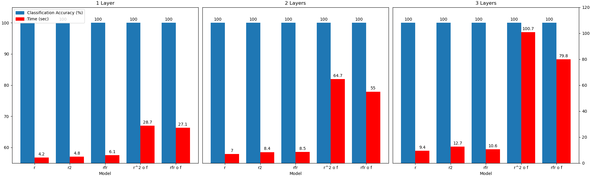
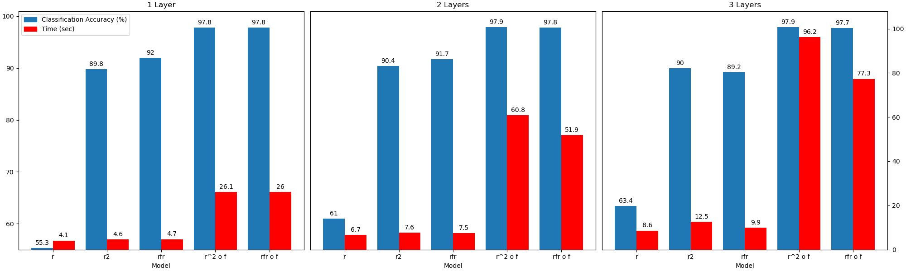
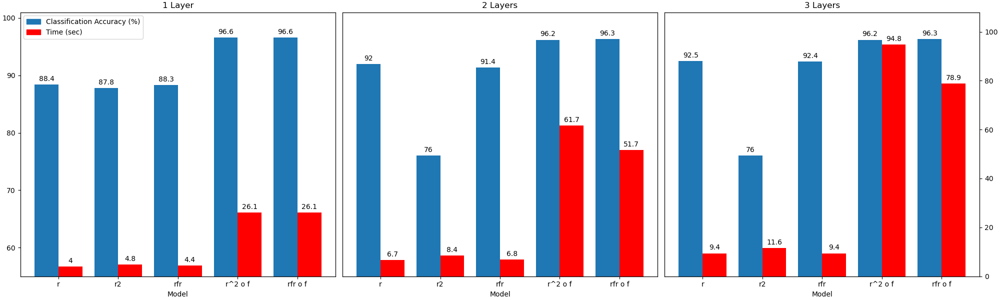
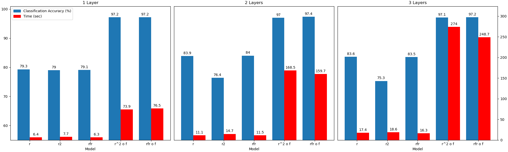

# R-FR-GNNs: Optimized Readouts for Multi-Relational Graph Neural Network Classifiers

R-FR-GNNs (and R<sup>1+d</sup>-GNNs) are evolutions to R<sup>2</sup>-GNNs, the first models to learn Boolean classifiers on multigraphs. 
When combined with a pretransformation step, these models can learn all $\mathcal{FOC}_2$ classifiers.
Our new proposed methods achieve the same performance (both theoretically and empircally) as the previous SOTA with greater efficiency (by reducing the number of costly readout operations).

Read the [full report on Overleaf](https://www.overleaf.com/read/kdjfwmcqjcsd#53d9ee).
Replicate and visualize our results using the below.

## Dependencies

Run `pip install -r requirements.txt` to install all dependencies.

## Generate synthetic graphs

Download datasets from https://drive.google.com/file/d/1t8oKegE79ctV5aiMKyklmXbV5-fCODgk/view?usp=sharing, then unzip it under `src/`

Run `generate/generate.cpp` for synthetic graphs and `generate/generate_trans.cpp` for their transformations.

## Replicate results

Create a directory `src/logging/results`.
From the `src/` directory, run command `python main.py [dataset] [time_range] [num_relation]`.
Models will automatically run on static multi-relational equivalents of generated graphs.
Results will be printed to console and logged in `src/logging/results`. 
A single file will collect the last epoch for each experiment for each dataset.

A description for different datasets and the specific arguments required are as follows:

```
python src/main.py tp1 2 1                          #\varphi_1
python src/main.py tp2 2 1                          #\varphi_2
python src/main.py tp3 2 1                          #\varphi_3
python src/main.py tp1_trans 1 2                    #transformed \varphi_1
python src/main.py tp2_trans 1 2                    #transformed \varphi_2
python src/main.py tp3_trans 1 2                    #transformed \varphi_3
python src/main.py tp4 10 3                         #\varphi_4
python src/main.py tp4_trans 1 30                   #transformed \varphi_4
```

## Results

We test vanilla R-GNNs, R<sup>2</sup>-GNNs, R-FR-GNNs, as well as the latter two with a graph pretransformation step.
Tests were conducted on 500 multigraphs with 50-1000 nodes each on the following classifiers using MPS on an Apple Silicon 10-Core M1 Pro. Find more details in our report.

### $\varphi_1 := \exists^{\geq 2}y(p_1(x,y)\land Red(y))\land \exists^{\geq 1}y(p_2(x,y)\land Blue(y))$


### $\varphi_2 := \exists^{[10,20]}y(\lnot p_2(x,y)\land \varphi_1(y))$


### $\varphi_3 := \exists^{\geq 2}y(p_1(x,y) \land p_2(x,y))$


### $\varphi_4 := \bigvee_{3\leq t\leq 10} (\exists^{\geq 2}y(Black_t(y)\land Red_{t-1}(y)\land Blue_{t-2}(y)\land p_{3t+1}(x,y)\land p_{3t-1}(x,y)\land p_{3t-3}(x,y)\land \varphi_t(y))) \\ \qquad\text{where } \varphi_t(y) := \exists^{\geq 2}x(p_{3t+1} \land Red_t(x)) \land \exists^{\geq 1}x(p_{3t-1}(x,y)\land Blue_{t-2}(x))$

